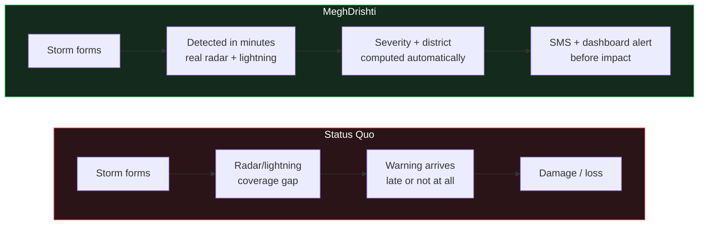
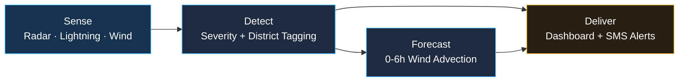
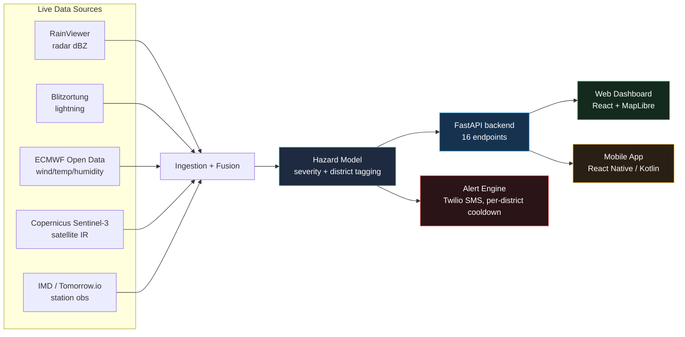
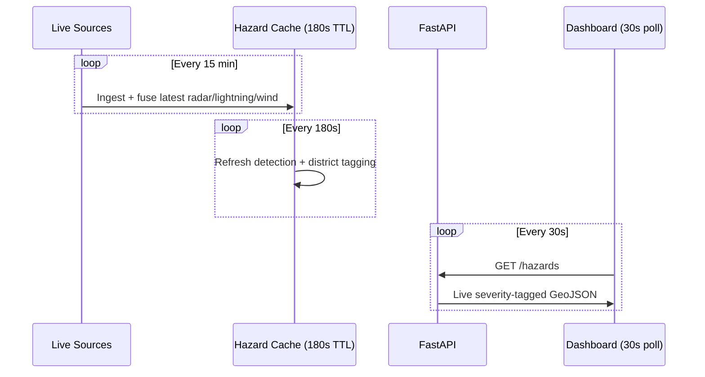
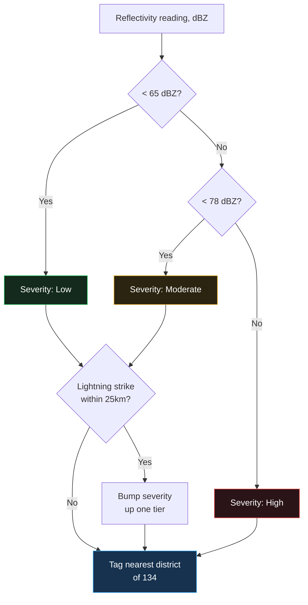
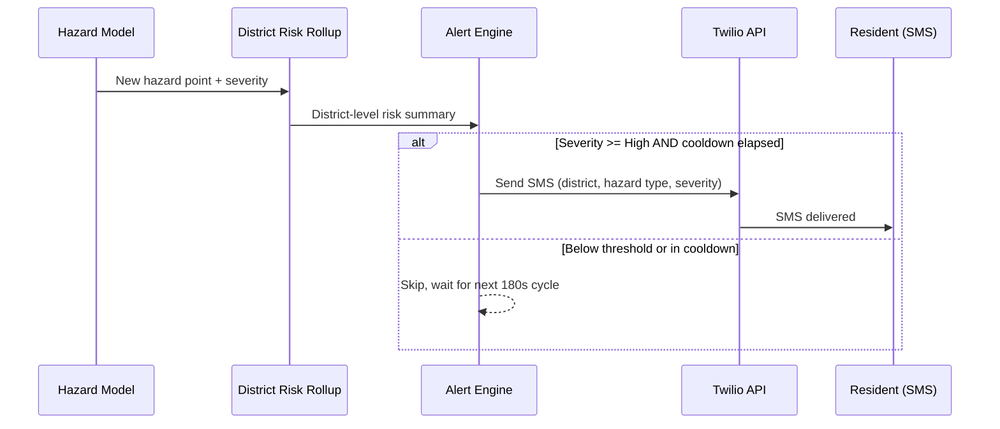
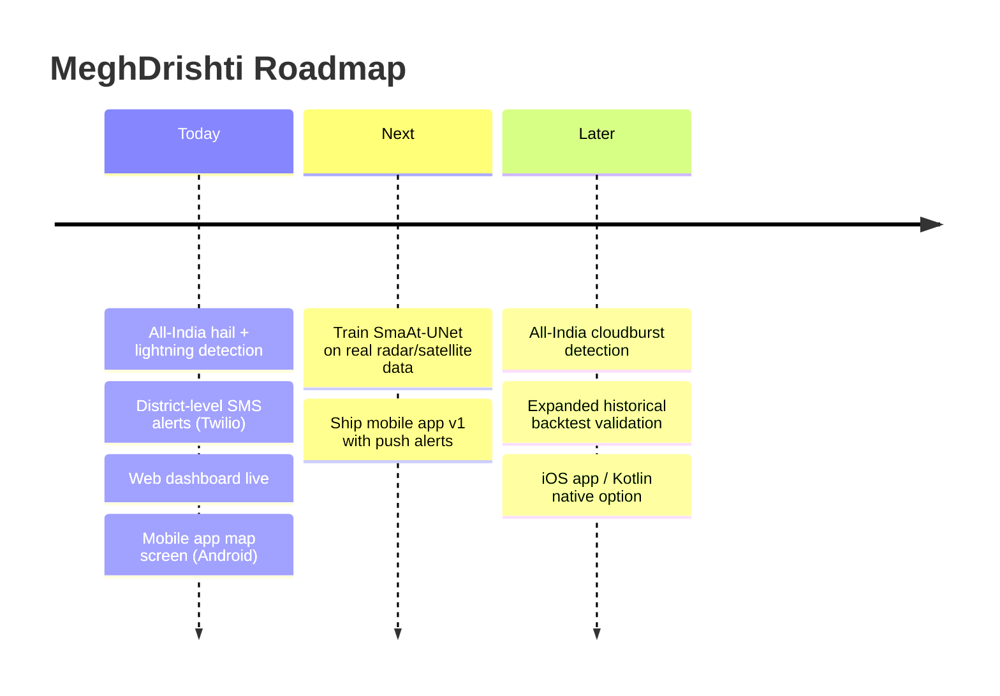

# MeghDrishti — 7-Slide Pitch Deck Content Spec

A complete content prompt for building the SIH pitch deck: per slide, the
exact text-box copy, a flowchart description, and a ready-to-render Mermaid
diagram. Everything here is grounded in the actual codebase and a live
backend check (dates: verified 2026-09-27) — nothing is invented. Where a
feature is real-but-not-yet-proven-at-scale, that's called out explicitly
in an "**Honesty note**" so whoever presents doesn't accidentally overclaim
to judges who ask follow-up questions.

Feed this whole file to a slide-generation tool, or hand it to a
teammate building the deck by hand in PowerPoint/Google Slides/Canva —
every slide has enough detail to build directly from.

**Design system**: dark background (`#0a0e16`), panel `#131924`, accent
blue `#3fb6ff`, severity green/yellow/red (`#22c55e`/`#f0b429`/`#ef4444`)
— matches the actual product screenshots in `pitch_assets/` and the web
dashboard, so slides feel like the same product, not a generic template.

---

## Slide 1 — Title & Problem Statement

**Text box 1 (title, large, top-third):**
> **MeghDrishti**
> Real-Time, All-India Convective Hazard Nowcasting
> Smart India Hackathon 2026

**Text box 2 (problem statement, left half):**
> **The Gap**
> - India's Doppler radar network has real coverage gaps — many districts have no local radar within useful range.
> - Hailstorms, lightning, and sudden downpours often strike with only minutes of warning at the ground level.
> - Existing public tools show weather *observations*, not a live, country-wide *hazard* picture with severity and location.
> - Warnings, when they exist, rarely reach the people standing in the storm's path in time to act.

**Text box 3 (call-out stat strip, bottom):**
> 3.29M km² of India · 5 live data sources · 0–6 hour lead time · one unified pipeline

**Flowchart description**: A simple two-row "before / after" comparison.
Top row (red-tinted): *Storm forms → gap in coverage → alert arrives late
(if at all) → damage/loss*. Bottom row (green-tinted): *Storm forms →
detected within minutes (real radar + lightning) → severity + location
computed → SMS/dashboard alert reaches people before impact*.

**Mermaid diagram:**

---

## Slide 2 — Solution Overview

**Text box 1 (headline):**
> One pipeline. Five real data sources. All of India, updated every few minutes.

**Text box 2 (four-stage summary, center):**
> 1. **Sense** — Pull real radar reflectivity, lightning strikes, and atmospheric data continuously.
> 2. **Detect** — Classify hail and lightning hazards by severity (low/moderate/high), tagged to the exact district.
> 3. **Deliver** — Push the live picture to a web dashboard, and trigger SMS alerts for high-severity events near people.
> 4. **Forecast** — Project each hazard's position 0–6 hours ahead using real wind data (pySTEPS motion + ECMWF wind advection).

**Text box 3 (what makes it different):**
> - Country-scale, not city-scale — most nowcasting demos cover one city; this covers all 3.29M km² of India at once.
> - Honest about real vs. demo data — every layer is explicitly labeled in the codebase as real or synthetic-backed; nothing is faked to look more complete than it is.
> - District-aware — 134 district centroids let every hazard roll up to "which district is at risk," not just a lat/lon dot.

**Flowchart description**: Horizontal 4-box pipeline — Sense → Detect →
Deliver → Forecast, with a small icon per stage (satellite dish, shield,
phone/bell, clock).

**Mermaid diagram:**

---

## Slide 3 — System Architecture

**Text box 1 (component list, left column):**
> **5 Real Data Sources**
> - RainViewer — radar reflectivity (dBZ), all-India
> - Blitzortung — live lightning strikes, all-India
> - ECMWF Open Data — wind, temperature, humidity, pressure
> - Copernicus Sentinel-3 — satellite IR (regional)
> - IMD / Tomorrow.io — station observations

**Text box 2 (pipeline stages, right column):**
> **Backend (FastAPI, Python)**
> - Ingestion + fusion of all live sources
> - Hazard model: severity classification + district tagging
> - Alert engine: Twilio SMS on high-severity, per-district cooldown
> - 16 REST endpoints, all-India hazard cache refreshed every 180s
>
> **Frontend**
> - Web dashboard — React + MapLibre, live map, severity legend, lead-time slider
> - Mobile app (in progress) — React Native / Kotlin, same live data

**Flowchart description**: The exact diagram already generated in
`pitch_assets/architecture.png` — five source boxes on the left feeding
into Ingestion+Fusion → Hazard Model → FastAPI, which fans out to Web
Dashboard, Mobile App, and (new) SMS Alerts.

**Mermaid diagram:**

**Honesty note**: present the mobile app as "in progress" (a working
native map screen exists on an Android emulator, not yet a shipped app) —
don't claim it's a finished, released product.

---

## Slide 4 — Live Data Pipeline & Coverage

**Text box 1 (coverage stat strip — pull fresh from `pitch_assets/coverage.png`):**
> 3.29M km² covered · 150×150 detection grid (~22km/cell) · 15-min ingestion cycle · 180s hazard cache refresh · 30s dashboard poll

**Text box 2 (real vs. synthetic honesty table — reuse `pitch_assets/data_sources_table.png` content):**
| Layer | Status | Source |
|---|---|---|
| Hail + Lightning | Always real | RainViewer + Blitzortung |
| Radar reflectivity | Real, all-India | RainViewer (IMD-sourced) |
| Temp/Humidity/Wind/Pressure | Real, all-India | ECMWF Open Data HRES |
| Satellite IR | Real, regional | Copernicus Sentinel-3 |
| pySTEPS forecast motion | Real (as of latest update) | Live consecutive RainViewer frames |
| Downburst / Cloudburst | Synthetic-backed demo | No public Doppler-velocity source exists |

**Text box 3 (why this matters):**
> We chose to be explicit about what's real-time-verified vs. demo-only
> rather than blur the line — every hazard point in the API carries a
> `source` field, and the pySTEPS forecast now runs its motion estimation
> on real historical radar frames instead of synthetic ones.

**Flowchart description**: A timeline strip showing the three nested
refresh cadences — outer 15-min ingestion cycle, middle 180s hazard-cache
refresh, inner 30s dashboard poll — as concentric or stacked bars.

**Mermaid diagram:**

---

## Slide 5 — Hazard Detection Model

**Text box 1 (classification rule — reuse `pitch_assets/severity_thresholds.png`):**
> **Hail severity** (reflectivity-based)
> - < 65 dBZ → **Low**
> - 65–78 dBZ → **Moderate**
> - ≥ 78 dBZ → **High**
> - +1 tier if a real lightning strike lands within 25km
>
> **Lightning** — any real strike is always classified **High** (an actual strike is an immediate hazard, not a graded risk).

**Text box 2 (district targeting):**
> Every hazard point is automatically tagged with its nearest of **134
> Indian district headquarters** (name + state), turning a raw lat/lon
> into "which district needs to know about this" — the input to the
> alert engine on the next slide.

**Text box 3 (research direction — SmaAt-UNet):**
> We've implemented the **SmaAt-UNet** architecture (depthwise-separable
> convolutions + attention, a published deep-learning nowcasting design)
> in PyTorch and verified its forward pass end-to-end. It is **not yet
> trained on real radar sequences** — this is next-phase work, not a
> claim of an AI model in production today.

**Text box 4 (validation — backtest against real historical events):**
> We backtested the cloudburst detection rule against **4 real,
> documented Indian weather events** (incl. the 2024 Delhi
> airport-roof-collapse downpour and 2024 Pune flash floods) using real
> ERA5 reanalysis data: **1 true positive, 2 true negatives, 0 false
> positives, 1 false negative** (Precision 1.00, Recall 0.50 on this
> small sample). We're upfront that n=4 is a pilot validation, not a
> large-scale accuracy claim — it's a proof that the method works on at
> least one real severe event, with a documented, explained miss.

**Flowchart description**: A decision-tree diagram — reflectivity value
enters, branches into the three severity tiers, with a side-branch
showing the lightning-proximity check bumping severity up one level, then
merges into "tag with nearest district."

**Mermaid diagram:**

---

## Slide 6 — Alerting: From Detection to Action

**Text box 1 (alert pipeline):**
> When a hazard is classified **High severity** in a district, the
> system checks a per-district cooldown (default 60 minutes, configurable)
> to avoid spamming, then sends a real **SMS alert via Twilio** — not a
> mockup, an actual integration against Twilio's REST API.

**Text box 2 (multi-channel delivery):**
> - **SMS** — Twilio, for people without a smartphone data connection in the moment
> - **Web dashboard** — live map, severity legend, glowing pulsing markers, click-to-inspect
> - **Mobile app** (in progress) — same live data, native map, planned push notifications for "alert me near my location"

**Text box 3 (honesty note, small print):**
> The Twilio integration requires a funded account and phone number
> (`TWILIO_ACCOUNT_SID`/`TWILIO_AUTH_TOKEN`/`ALERT_TO_NUMBERS`) to
> actually send messages — the code path is real and wired into the live
> hazard loop, but this demo environment doesn't have paid credentials
> configured, so live SMS won't fire during a judged demo unless that's
> set up beforehand.

**Flowchart description**: A left-to-right pipeline — hazard detected →
district risk rollup → severity ≥ High? → cooldown check → SMS sent /
dashboard updated, with a "no" branch from each gate looping back to
"wait for next cycle."

**Mermaid diagram:**

---

## Slide 7 — Impact, Validation & Roadmap

**Text box 1 (project scale — reuse `pitch_assets/project_scale.png`):**
> 8,167 lines of code · 64 source files · 16 REST endpoints · 5 live data integrations · 50 commits of active development

**Text box 2 (what's proven today):**
> - Real-time hail + lightning detection, all of India, no synthetic filler
> - Real district-level tagging and SMS alert pipeline (Twilio-integrated)
> - Real historical backtest against documented Indian severe-weather events
> - Live web dashboard; native mobile app map screen running on Android

**Text box 3 (roadmap — next 3 phases):**
> 1. **Train SmaAt-UNet** on real satellite/radar sequences (currently architecture-only, untrained)
> 2. **Ship the mobile app** — push notifications for hazards near the user's live location
> 3. **Expand backtesting** beyond 4 events, and extend `fetch_india_reflectivity_sequence` to bring cloudburst detection to all-India scale (currently regional-demo only)

**Text box 4 (closing line):**
> MeghDrishti isn't a mockup of a nowcasting system — it's a real pipeline
> pulling real data, right now, for all of India, with a clear and honest
> roadmap for what's next.

**Flowchart description**: A horizontal roadmap timeline — "Today"
(current state, green) → "Next" (SmaAt-UNet training, mobile ship) →
"Later" (all-India cloudburst, expanded validation) — three time-boxed
sections left to right.

**Mermaid diagram:**

---

## Notes for whoever builds the actual slides

- Slides 3, 4, 5 pair naturally with the pre-generated images in
  `pitch_assets/` (`architecture.png`, `data_sources_table.png`,
  `severity_thresholds.png`, `coverage.png`) — use those images directly
  rather than redrawing, they're already styled to match.
- Slide 7's project-scale numbers should be **re-verified** right before
  presenting by re-running `pitch_assets/make_charts.py` — code/commit
  counts will have moved on from this writing.
- Every "Honesty note" in this document exists because a judge asking
  "is this actually trained?" / "does the SMS actually send?" /
  "how many events did you validate against?" deserves a true answer —
  keep those caveats in the speaker notes even if the slide text itself
  is the punchier, caveat-free version.
